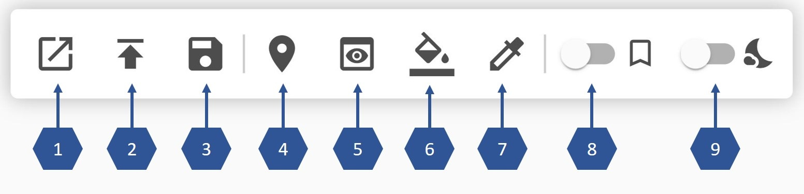

# Building Plan Viewer 
v0.2.0

This is a web application for viewing CAD files in DXF format that represent digital building plans.
Beside viewing the building plan, the application can also combine it with a specified mapping allowing to color certain rooms (polygons). 
This may be used for showing their cluster membership after a clustering of rooms, or for visualizing other analysis results or room queries.

The application was developed as part of student projects at the HM Munich University of Applied Sciences, within the context of the research project NuData Campus.
Version v0.2.0 is a further development from a previous student project published under https://github.com/bennyboer/building-plan-viewer/.

## Getting started

### Requirements

You need to have the Java Development Kit (JDK) 15 installed.

### Configurations

You need to set the environment variables in: 
* building-plan-viewer-main/client/src/environments/environment.ts
* building-plan-viewer-main/client/src/environments/environment.prod.ts

You also need to change the *link* in: 
* building-plan-viewer-main/server/src/main/resources/application.yml

This is where an exported file will redirect to when clicking on the button 'Return to Viewer'.
Set your own IP address and port.

### Building the application

There are multiple ways to build and deploy the application. 
You may use a jar file or a docker image.

#### Bootable JAR

In order to build a bootable jar, you'll have to run `gradlew.bat bootJar` (Windows) or `gradlew bootJar` (Linux).
You'll find the built JAR file at */server/build/libs*.

Execute the application using `java -jar server/build/libs/server-0.2.0.jar`.
By default the application will run at port 8080, which is configurable using the command line option `--server.port [your port]`.
You may change the port, e.g. to 8085, (or apply other Spring Boot supported settings) by calling 
`java -jar .\server\build\libs\server-0.2.0.jar --server.port=8085` or the equivalent syntax `java -jar -Dserver.port=8085 .\server\build\libs\server-0.2.0.jar`.

#### Docker image

You may as well build a Docker image using `gradlew.bat bootBuildImage`.
Therefore you may need to specify the Builder-Version because of Java-Version incompatibilities using e.g. `gradlew bootBuildImage --builder paketobuildpacks/builder:0.0.464-base`.

Afterwards you'll find the image under the name *building-plan-viewer* when running `docker image list`.
Deploy the container by using for example `docker run --name viewer -p 8080:8080 --rm building-plan-viewer:0.2.0` 
(Make sure the version is correct by running 'docker image list' beforehand).
By default the application will run at port 8080. You may change it by `-p [your port]:8080` - e.g., for port 8085: 
`docker run --name viewer -p 8085:8080 --rm building-plan-viewer:0.2.0`. 

For running the viewer with a mounted volume (needed for Export-Endpoint) run 
`docker run --name viewer -p 8080:8080 --mount source=app-new,target=/var/lib/data:rw --rm building-plan-viewer:0.2.0`.

Stop the container by running `docker container stop viewer`.

## Using the Viewer

The *docs/* folder contains some example files to try out the functionality of the viewer.

#### Examples

1.  Architecture Plan

This is an example generated by using the example plan *floorplan.dxf*, which is provided under the MIT-License from https://github.com/jscad/sample-files/blob/master/dxf/dxf-parser/floorplan.dxf.

 

2.  Simple Plan and Room Mapping

This is an example based on *simple-floorplan.dxf*. The file is inspired by *floorplan.dxf* and contains room polygons for an equivalent building.
The example further uses *room_mapping.csv*, which contains an according mapping of room names and categories.

#### Quick User Guide

The following main functionalities are provided by this application.

###### GUI

1. *Open a file:* Allows you to open a CAD file that has previously been uploaded via button 2.
2. *Upload a file:* Opens an upload dialog to upload a CAD file in the DXF format.
3. *Export:* Exports the currently displayed visualization as an HTML file.
4. *Manage room mappings:* Opens a dialog where you can either upload a room mapping as CSV file, or select a previously uploaded mapping. In order to be processed, the mapping should contain: RoomNumber, Cluster, MappingVertex as string (one vertex of the polygon belonging to this room), and Description (see example file *docs/room-mapping.csv*).
5. *Reset viewport:* Resets the viewport to default layout after zooming.
6. *Select Color:* Opens a color picker to select a custom color. When clicking on a color in the legend on the right side of the screen, the color of this category is replaced by the selected one.
7. *Set Background Color:* Replaces the background color of the visualization by the color currently selected in the color picker (see button 6).
8. *Toggle Room Labels:* When selected, room labels specified in the room mapping are not displayed.
9. *Toggle Dark Mode:* When selected, the application uses dark colors.

###### API

The viewer also provides an API, which allows it to be used with external analysis tools.
File uploads, selection of plan and mapping, and HTML export of the visualization can also be iniciated via the respective enpoints.
A full API documantation can be found under `/api/documentation.html` when running the application.
The following endpoints are available:

